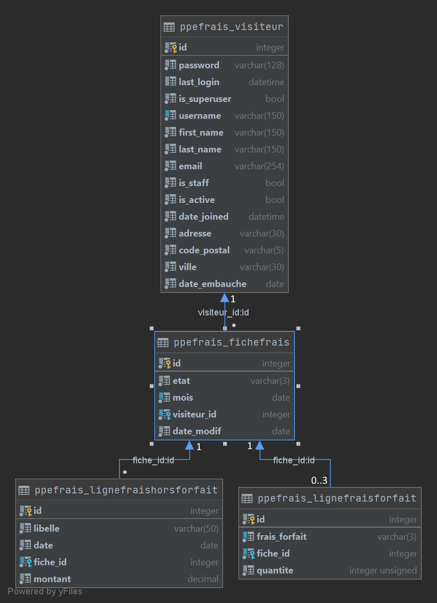
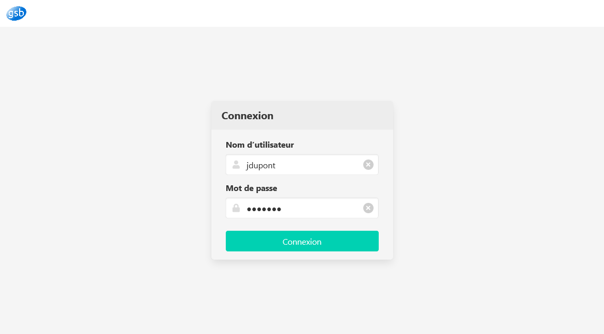
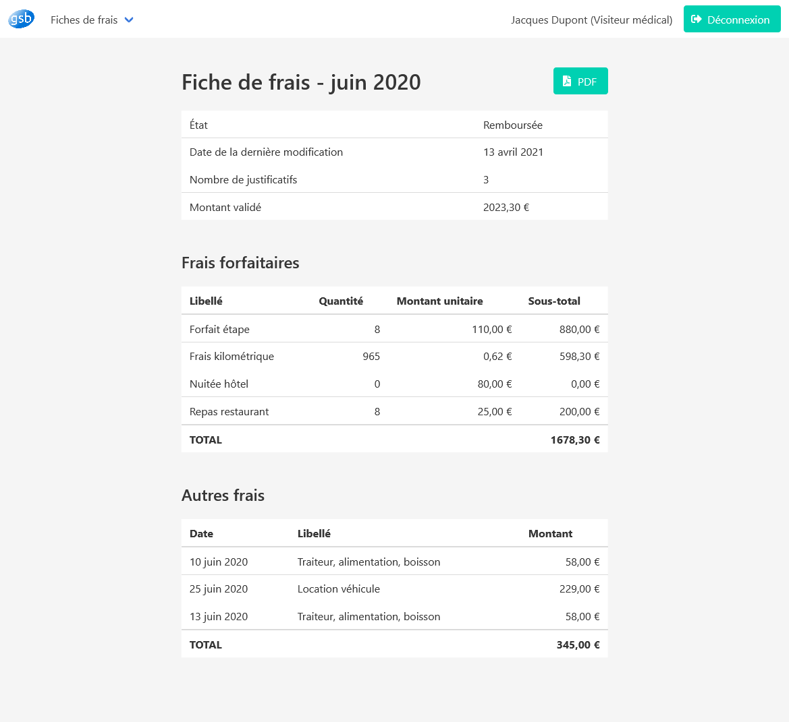

                                                                                  
                                                    @@@@                        
                                                    @@@@                        
                                                    @@@@                        
                                                    @@@@                        
              @@@@@@@@@@@@@@       @@@@@@@@@@@      @@@@@@@@@@@@@@,             
           ,@@@@(       @@@@     @@@@               @@@@@       @@@@@           
          &@@@.         @@@@     @@@@               @@@@          @@@@          
          @@@@          @@@@      @@@@@@,           @@@@          #@@@          
          @@@@          @@@@          @@@@@@@,      @@@@           @@@          
          @@@@          @@@@               @@@@     @@@@          @@@@          
           &@@@@*      @@@@@               .@@@     @@@@         @@@@           
              @@@@@@@@@@@@@@     @@@@@@@@@@@@@      @@@@@@@@@@@@@@@             
                        @@@@        %%%%%                %%%%%                  
                       @@@@                                                     
           @@@@@@@@@@@@@@                                                       
           

# Frais - PPE 2 GSB
## ***Application client léger pour la gestion des frais des visiteurs GSB.***
  
Projet personnel encadré réalisé par **Thomas SANTONI** et **Thibault THOMAS**,  
étudiants en 2e année de **BTS Services informatiques aux organisations**.  

Professeur : Mme CHATAING  
Sup'Chassagnes - Oullins (69)  
 
---

## Sommaire
1. [Introduction](#1-introduction)   
  1.1. [Contexte](#11-contexte)  
  1.2. [L'existant - la nouvelle application](#12-lexistant--la-nouvelle-application)  
  1.3. [Technologies mises en oeuvre](#13-technologies-et-savoir-faire-mis-en-oeuvre)  
2. [Utiliser l'application sur une machine de développement](#2-utiliser-lapplication-sur-une-machine-de-d%C3%A9veloppement)  
  2.0. [Environnement logiciel requis](#20-environnement-logiciel-requis)  
  2.1. [Récupération du dépôt Git](#21-r%C3%A9cupération-du-d%C3%A9p%c3%b4t-git)  
  2.2. [Création et activation de l'environnement Python virtuel](#22-cr%C3%A9ation-et-activation-de-lenvironnement-python-virtuel)  
  2.3. [Installation des dépendances requises avec PIP](#23-installation-des-d%C3%A9pendances-requises-avec-pip)  
  2.4. [Création et exécution des migrations](#24-cr%C3%A9ation-et-ex%C3%A9cution-des-migrations)  
  2.5. [Chargement du jeu de données initial dans la base de données](#25-chargement-du-jeu-de-donn%C3%A9es-initial-dans-la-base-de-donn%C3%A9es)  
  2.6. [Démarrage du serveur de développement](#26-d%C3%A9marrage-du-serveur-de-d%C3%A9veloppement)  
3. [Déploiement du projet sur un serveur de production](#3-d%C3%A9ploiement-du-projet-sur-un-serveur-de-production)  
  3.1. [Mise à jour et installation des paquets](#31-mise-%C3%A0-jour-et-installation-des-paquets)  
  3.2. [Configuration initiale du projet Django](#32-configuration-initiale-du-projet-django)    
  3.3. [Création des variables d'environnement pour la production](#33-cr%C3%A9ation-des-variables-denvironnement)  
  3.4. [Configuration de la base de données PostgreSQL](#34-configuration-de-la-base-de-donn%C3%A9es-PostgreSQL)  
  3.5. [Terminer la configuration du projet Django](#35-terminer-la-configuration-du-projet-django)     
  3.6. [Création de fichiers de socket et de service systemd pour Gunicorn](#34-cr%C3%A9ation-de-fichiers-de-socket-et-de-service-systemd-pour-gunicorn)   
  3.7. [Configuration de Nginx](#35-configuration-de-nginx)  
  3.8. [Sécurisation de Nginx avec Let's Encrypt](#36-s%C3%A9curisation-de-nginx-avec-lets-encrypt)  
4. [Annexes](#4-annexes)  
  4.1. [Diagramme UML](#41-diagramme-uml)  
  4.2. [Captures d'écran](#42-captures-d%C3%A9cran)   
---

## 1. Introduction
### 1.1. Contexte
Le laboratoire a mis à disposition des visiteurs médicaux une application permettant de visualiser et saisir les frais engagés par les visiteurs lors des visites aux praticiens. Ces frais concernent les déplacements, la restauration et l’hébergement générés par l’activité de visite médicale.

Le remboursement de l'ensemble des frais engagés par les visiteurs s’organise mensuellement et donne lieu à une fiche de frais identifiée par le numéro du visiteur et le mois de l’année.

À chaque dépense type (hôtel, repas, ...) correspond un montant forfaitaire appliqué (on parle de frais "forfaitisé"). Le justificatif n’est pas demandé (les rapports de visite serviront de preuve) mais doivent être conservés pendant trois ans par les visiteurs. Des contrôles réguliers sont faits par les délégués régionaux qui peuvent donner lieu à des demandes de remboursement de trop perçu par le visiteur.

Pour toute dépense en dehors du forfait (repas en présence d'un spécialiste lors d'une animation, achat de fournitures, réservation de salle pour une conférence, etc), le visiteur enregistrera la date, le montant et le libellé de la dépense. Il doit fournir au service comptable une facture acquittée. Le système à produire doit lui indiquer le nombre de justificatifs pris en compte dans le remboursement.

### 1.2. L'existant / la nouvelle application
L’application de gestion des frais de visite actuelle est développée en PHP objet et respecte le pattern MVC.

**Une nouvelle application web, développée en Python avec le framework Django, doit être développée.
Elle est destinée aux visiteurs médicaux et doit leur permettre de consulter leurs états de frais.**

Une autre application sera développée dans un second temps pour permettre au personnel du service comptable de GSB de faire le suivi des états de frais des visiteurs médicaux jusqu'à leur règlement.

*Pour connaître l'intégralité du contexte et le cahier des charges, consulter la* [fiche des consignes](dossier_technique/consignes.pdf). 


### 1.3. Technologies et savoir-faire mis en oeuvre
+ Langage orienté objet (et multi-paradigmes) : Python
+ Développement web avec le framework Django 
  + patron de conception MVT (Modèle - Vue - Template)
  + ORM intégré et "database agnostic"
+ CSS avec le framework Bulma (responsive design)
+ JavaScript
+ Génération de fichiers PDF téléchargeables et au contenu dynamique grâce à un module Python
+ Système de contrôle de version : Git
+ Livraison incrémentale du projet grâce à la méthode Scrum
 
---

## 2. Utiliser l'application sur une machine de développement
### 2.0. Environnement logiciel requis
+ Windows ou Linux avec Python 3.8 (MacOS non testé)
+ Un terminal pour configurer le projet et lancer les commandes d'administration de Django
+ Au choix, un simple éditeur de texte ou un IDE
+ Un navigateur web pour naviguer sur le site
  + de préférence autre que Internet Explorer, car le framework CSS Bulma n'est pas totalement compatible
  
### 2.1. Récupération du dépôt git
```
git clone https://github.com/th-thomas/Frais/
```

### 2.2. Création et activation de l'environnement Python virtuel 
Se placer dans le répertoire du projet, puis exécuter les commandes suivantes.
+ Sous Windows :
  ```shell
  virtualenv venv
  .\venv\Scripts\activate
  ```
+ Sous Linux :
  ```bash
  virtualenv venv
  source venv/bin/activate
  ```

### 2.3. Installation des dépendances requises avec PIP
```bash
python -m pip install -r requirements.txt
```

### 2.4. Création et exécution des migrations
> Les migrations sont la manière par laquelle Django propage des modifications que vous apportez à des modèles (ajout d’un champ, suppression d’un modèle, etc.) dans un schéma de base de données.

Exécuter dans cet ordre les commandes :
```shell
python manage.py makemigrations
python manage.py migrate
```

> #### Notes
> La commande `migrate` exécute les migrations. Cette fois-ci, elle a permis de créer la base de données (fichier SQLite`db.sqlite3`) et d'y créer les tables correspondant aux modèles.
>
> La commande `makemigrations` est responsable de la création de nouvelles migrations en fonction des modifications apportées aux modèles.
>
> + Comme le projet contient déjà le fichier de migration initial, et qu'aucune modification n'a été apportée aux modèles, cette commande n'aura aucune incidence cette fois-ci.  
>
> + **Elle devra cependant être exécutée préalablement à la commande `migrate` chaque fois qu'une modification sera apportée aux modèles (fichier `models.py` du répertoire `ppefrais`).**

### 2.5. Chargement du jeu de données initial dans la base de données
La base de données, désormais construite, est pour l'instant vide.  
Il faut lui ajouter des données grâce à la commande :
```
python manage.py load_data
```
qui génère des données en créant un visiteur médical et en lui attribuant des fiches de frais pour l'année courante et l'année précédente.  

À la fin de son exécution, **elle affiche également les identifiants nécessaires pour se connecter au site.**

>D'une manière générale :
>+ le **nom d'utilisateur** d'un utilisateur (visiteur médical) est, en minuscules et sans accents, la chaîne de caractères formée par **la première lettre de son prénom suivie du nom.**
>+ son **mot de passe** par défaut est sa **date d'embauche au format jjmmaaaa.**

### 2.6. Démarrage du serveur de développement
Saisir la commande
```shell
python manage.py runserver
```
afin de démarrer le serveur de développement. Le serveur fonctionne sur le port 8000 à l'adresse 127.0.0.1.

Pour accéder au site, il faut donc saisir l'adresse suivante dans le navigateur web :
```
http://127.0.0.1:8000/
```
et, sur la page de connexion qui s'affiche, saisir les identifiants qui ont été donnés auparavant.

Voici, pour rappel, les identifiants du visiteur médical créé avec la commande `load_data` :  
+ Nom d'utilisateur : `jdupont`
+ Mot de passe : `31121999`

## 3. Déploiement du projet sur un serveur de production
Exemple de procédure de déploiement sur un serveur Ubuntu 20.04 avec Nginx, Gunicorn et une base de données PostgreSQL.

Nous reprenons largement [la démarche proposée par DigitalOcean](https://www.digitalocean.com/community/tutorials/how-to-set-up-django-with-postgres-nginx-and-gunicorn-on-ubuntu-20-04-fr).

### 3.1. Mise à jour et installation des paquets
```bash
sudo apt update
sudo apt install python3-pip python3-dev libpq-dev PostgreSQL PostgreSQL-contrib nginx curl
```

### 3.2. Configuration initiale du projet Django
#### 3.2.1. Récupération du dépôt Git
Se référer à l'[étape 2.1](#21-r%C3%A9cupération-du-d%C3%A9p%c3%b4t-git).  

#### 3.2.2. Création et activation de l'environnement Python virtuel
Se référer à l'[étape 2.2](#22-cr%C3%A9ation-et-activation-de-lenvironnement-python-virtuel).  

#### 3.2.3. Installation des dépendances requises avec PIP
Dans un premier temps, se référer à l'[étape 2.3](#23-installation-des-d%C3%A9pendances-requises-avec-pip).  

Puis, en se plaçant dans le répertoire du projet Django, installer le serveur Gunicorn et l'adaptateur PostgreSQL grâce à la commande :
```bash
pip install -r requirements_prod.txt
```

#### 3.2.4. Ajustement des paramètres du projet
Se placer dans le répertoire du projet et ouvrir le fichier `settings_prod.py` (situé dans le répertoire `gsb`) :
```
nano gsb/settings_prod.py
```

Localiser la directive `ALLOWED_HOSTS`.

Dans les crochets, lister les adresses IP ou les noms de domaine associés au serveur Django. Chaque élément devrait être listé dans des guillemets avec les entrées séparées par une virgule. 

De plus, il convient d'inclure `localhost` parmi les options, car une instance locale de Nginx sera utilisée comme proxy pour les connexions.

Exemple :

```
ALLOWED_HOSTS = ['localhost', 'exempledesite.abc', '123.456.123.789']
```
> **Notes**
> 
> La clé secrète (`SECRET_KEY`) ainsi que les identifiants de l'utilisateur de la base de données (`USER` et `PASSWORD` de la section `DATABASES`) sont configurés pour récupérer leur valeur depuis les variables d'environnement. En effet, ces valeurs sont confidentielles et ne doivent pas être stockées dans le dépôt Git.
>
> Nous définirons les variables d'environnement dans le point suivant.
>
> Enfin, deux lignes concernent les fichiers statiques (fichiers CSS, JavaScript, logo...). `STATIC_URL` définit l'URL qui rend accessibles les fichiers statiques, `STATIC_ROOT` indique à Django dans quel répertoire placer les fichiers statiques pour que Nginx puisse ensuite traiter les requêtes les concernant (cf. point suivant).
>
> Nous avons choisi de définir l'URL à `/static/` et le répertoire à `staticfiles`.

### 3.3. Création des variables d'environnement
Le projet Django doit être configuré différemment selon qu'il est utilisé en phase de développement ou de production.

Nous allons donc spécifier les variables propres à l'environnement de production.

Tout d'abord, la [clé secrète de Django](https://docs.djangoproject.com/fr/3.2/ref/settings/#secret-key) doit rester confidentielle et ne doit pas apparaître dans les paramètres du fichier `settings_prod.py` du dépôt Git. Pour cela, nous la générons  depuis le serveur de production et demandons à Django de la chercher dans les variables d'environnement.

Il faut donc générer la clé secrète de Django pour la production. Pour cela, saisir dans le terminal la commande :
```bash
python -c 'from django.core.management.utils import get_random_secret_key; print(get_random_secret_key())'
```

La clé ainsi générée (par exemple `cnp-j0%wd_zab+l=d+v7&rw3p7h!tyu4tzzpz=ypm^$(-8+^t^`) s'affiche alors. La copier.

Ouvrir le fichier `~/.bashrc` (par exemple avec l'éditeur nano, grâce à la commande `sudo nano ~/.bashrc`) et lui ajouter les lignes suivantes :
```
export DJANGO_PRODUCTION = true
export DJANGO_SECRET_KEY = 'cnp-j0%wd_zab+l=d+v7&rw3p7h!tyu4tzzpz=ypm^$(-8+^t^'
export DJANGO_DB_USER = 'nom_d_utilisateur'
export DJANGO_DB_PASSWORD = 'mot_de_passe'
```
Remplacer évidemment l'exemple de clé secrète par celle qui a été générée, et `nom_d_utilisateur` et `mot_de_passe` par un nom d'utilisateur et un mot de passe de votre choix.

Grâce à la 1e variable créée (`DJANGO_PRODUCTION`), **le projet Django applique désormais les paramètres de production** (fichier `settings_prod.py` du répertoire `gsb`).

### 3.4. Configuration de la base de données PostgreSQL
> Durant toute cette étape, remplacer `nom_d_utilisateur` et `mot_de_passe` par les identifiants adhoc.

Se connecter à une session interactive de Postgres en tapant :
```bash
sudo -u postgres psql
```

Un invite de commandes Postgres s'ouvre alors (`postgres=#` s'affiche à l'écran).

Dans cet invite, créer la base de données à l'aide de la commande :
```sql
CREATE DATABASE gsbdb;
```

Puis créer l'utilisateur qui sera utilisé par l'application Django :
```sql
CREATE USER nom_d_utilisateur IDENTIFIED WITH PASSWORD 'mot_de_passe';
```

Exécuter ensuite les commandes suivantes, [recommandées par la documentation Django](https://docs.djangoproject.com/en/3.0/ref/databases/#optimizing-PostgreSQL-s-configuration) elle-même :
```sql
ALTER ROLE nom_d_utilisateur SET client_encoding TO 'utf8';
ALTER ROLE nom_d_utilisateur SET default_transaction_isolation TO 'read committed';
ALTER ROLE nom_d_utilisateur SET timezone TO 'UTC';
```

Enfin, il faut donner au nouvel utilisateur créé un accès pour administrer la nouvelle base de données :
```sql
GRANT ALL PRIVILEGES ON DATABASE gsbdb TO nom_d_utilisateur;
```

Quitter l'invite PostgreSQL en tapant :
```
\q
```

### 3.5. Terminer la configuration du projet Django
Dans un premier temps, appliquer les étapes [2.4](#24-cr%C3%A9ation-et-ex%C3%A9cution-des-migrations) et [2.5](#25-chargement-du-jeu-de-donn%C3%A9es-initial-dans-la-base-de-donn%C3%A9es).

Puis se placer dans le répertoire du projet Django et exécuter la commande :
```bash
python manage.py collectstatic
```

Les fichiers statiques sont alors placés dans le répertoire `staticfiles`, situé à la racine du projet.

La configuration de l'application Django est terminée. On peut maintenant désactiver l'environnement virtuel :
```bash
deactivate
```


### 3.6. Création de fichiers de socket et de service systemd pour Gunicorn
> Le socket de Gunicorn sera créée au démarrage et écoutera les connexions. Lorsqu'une connexion est établie, systemd démarrera automatiquement le processus de Gunicorn pour gérer la connexion.

Créer et ouvrir un fichier de socket de systemd pour Gunicorn avec les privilèges `sudo` :
```bash
sudo nano /etc/systemd/system/gunicorn.socket
```

Une fois le fichier ouvert, y créer une section `[Unit]` pour décrire la socket, une section `[Socket]` pour définir l'emplacement de la socket et une section `[Install]` pour s'assurer que la socket est créée au bon moment :
```
[Unit]
Description=gunicorn socket

[Socket]
ListenStream=/run/gunicorn.sock

[Install]
WantedBy=sockets.target
```

Enregistrer et fermer le fichier.

Puis créer et ouvrir un fichier de service systemd pour Gunicorn avec des privilèges `sudo`. Le nom de fichier de service doit correspondre au nom de socket, à l'exception de l'extension :
```
sudo nano /etc/systemd/system/gunicorn.service
```

Une fois le fichier ouvert, lui donner le contenu suivant :
```
[Unit]
Description=gunicorn daemon
Requires=gunicorn.socket
After=network.target

[Service]
User=sammy
Group=www-data
WorkingDirectory=/home/sammy/gsb
ExecStart=/home/sammy/gsb/virtualenv/bin/gunicorn \
          --access-logfile - \
          --workers 3 \
          --bind unix:/run/gunicorn.sock \
          gsb.wsgi:application

[Install]
WantedBy=multi-user.target
```

Remplacer les occurences de `sammy` par le nom de l'utilisateur courant.

> Par souci de brièveté, nous n'expliquons pas ici à quoi correspondent les lignes de ce fichier `gunicorn.service`. Le tutoriel de DigitalOcean donne ces explications.

Enregistrer et fermer le fichier. 

Puis démarrer et activer le socket Gunicorn :
```bash
sudo systemctl start gunicorn.socket
sudo systemctl enable gunicorn.socket
```

### 3.7. Configuration de Nginx
Créer un bloc serveur (VirtualHost Nginx) à l'aide de la commande :
```bash
sudo nano /etc/nginx/sites-available/gsb
```

Une fois le fichier ouvert, insérer le contenu suivant :
```
server {
    listen 80;
    server_name exempledesite.abc 123.456.123.789;

    location /static/ {
        alias /home/sammy/gsb/staticfiles/;
    }

    location / {
        include proxy_params;
        proxy_pass http://unix:/run/gunicorn.sock;
    }
}
```
La ligne commençant par `server_name` doit contenir les noms de domaine ou adresses IP auxquels le site est accessible.  

La section commençant par `location /static/` indique à Nginx le répertoire où trouver les fichiers statiques, liés à l'URI `/static/` : dans notre cas, le projet Django a déployé les fichiers dans le répertoire `/home/sammy/gsb/staticfiles/`.

Enregistrer et fermer le fichier. Nous pouvons maintenant activer le fichier en le reliant au répertoire `sites-enabled` :
```bash
sudo ln -s /etc/nginx/sites-available/gsb /etc/nginx/sites-enabled
```

Tester la configuration Nginx pour détecter les erreurs de syntaxe en tapant :
```bash
sudo nginx -t
```

Si aucune erreur n'est signalée, redémarrer Nginx avec la commande :
```bash
sudo systemctl restart nginx
```

Enfin, il faut ouvrir le pare-feu au trafic normal sur le port 80 :
```bash
sudo ufw allow 'Nginx Full'
```

### 3.8. Sécurisation de Nginx avec Let's Encrypt
Pour activer le chiffrement HTTPS du site, il est possible de configurer un certificat TLS/SSL avec Let's Encrypt.

Nous ne détaillons pas ici la procédure, car elle est optionnelle
(le PPE n'a pas nécessairement vocation à être sécurisé).

Néanmoins, il peut être intéressant de réaliser cette étape, c'est pourquoi nous donnons le lien vers [le très bon tutoriel de DigitalOcean](https://www.digitalocean.com/community/tutorials/how-to-secure-nginx-with-let-s-encrypt-on-ubuntu-20-04).

## 4. Annexes
### 4.1. Diagramme UML


Le diagramme UML est celui produit par DataGrip à partir de la structure de la base de données SQLite du projet.

Il ne contenait pas les cardinalités, qui ont été ajoutées manuellement par la suite.

À noter que le modèle Visiteur hérite du modèle AbstractUser proposé par Django.
D'où les champs `password`, `last_login`, `is_superuser`, `username`, `first_name`, `last_name`, `email`, `is_staff`, `is_active` et `date_joined`.

### 4.2. Captures d'écran
Quelques captures d'écran pour donner un aperçu du site :

| Page de connexion | Accueil |
| ----------------- | ------- |
|| |

| Fiche mois courant | Exemple fiche clôturée |
| ------------------ | ---------------------- |
||

| Proposition de rendu PDF d'une fiche (consignes) | Résultat produit par l'application |
| ------------------------------------------------ | ---------------------------------- |
|||